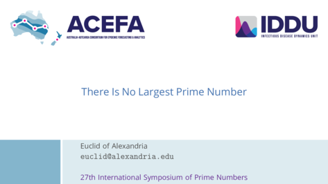

# Beamer theme: ACEFA and IDDU

This repository contains a Beamer theme that uses the ACEFA and IDDU branding.

**Important:** this theme only works with the XeLaTeX and LuaLaTeX toolchains.
Unless you have specific requirements, you should use `lualatex` instead of `xelatex`.
This theme will not work with `pdflatex`.

## Implementation details

See the following TeX StackExchange posts about Beamer themes and frame layout:

- [Build your own theme](https://tex.stackexchange.com/a/146682) by Claudio Fiandrino;
- [How does Beamer builder the frame?](https://tex.stackexchange.com/a/27302) by Andrew Stacey; and
- [How to create Beamer template?](https://tex.stackexchange.com/a/275123) by Gonzalo Medina.

Also see the Beamer source code for examples of:

- [Base themes](http://mirror.aarnet.edu.au/pub/CTAN/macros/latex/contrib/beamer/base/themes/theme/);
- [Colour themes](http://mirror.aarnet.edu.au/pub/CTAN/macros/latex/contrib/beamer/base/themes/color/);
- [Font themes](http://mirror.aarnet.edu.au/pub/CTAN/macros/latex/contrib/beamer/base/themes/font/);
- [Inner themes](http://mirror.aarnet.edu.au/pub/CTAN/macros/latex/contrib/beamer/base/themes/inner/); and
- [Outer themes](http://mirror.aarnet.edu.au/pub/CTAN/macros/latex/contrib/beamer/base/themes/outer/).
